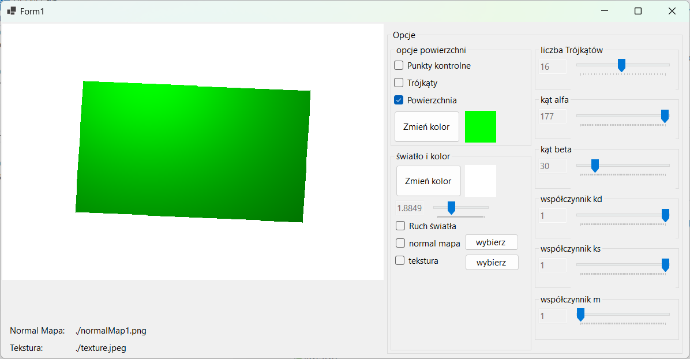
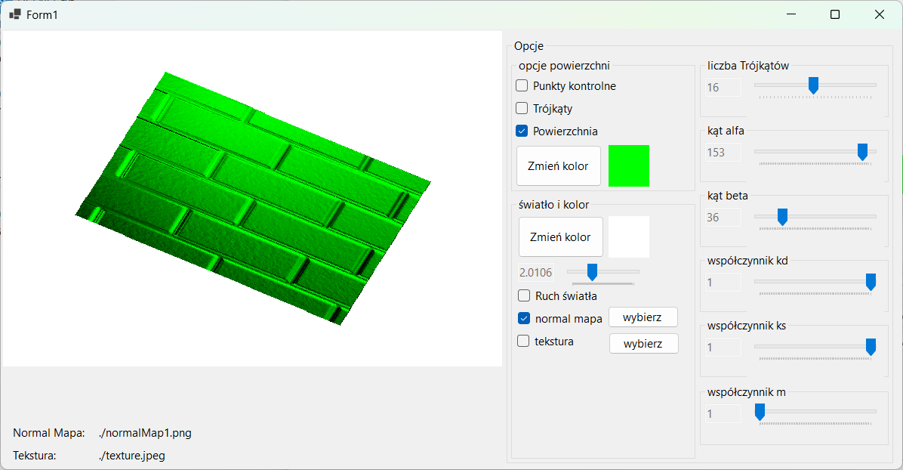
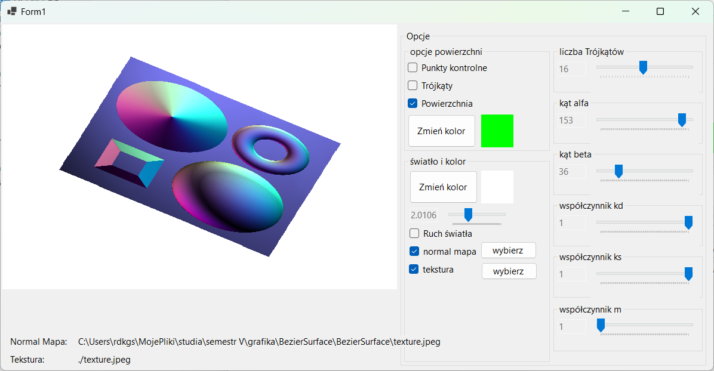

# Bezier Surface with moving light source

View bezier surface defined with points file (16 points), 
with coordinates in range [-1, 1] in all directions. 

Created with windows forms. Does not use gpu. 

## Bezier Surface points
Points defining the surface are loaded at runtime from "Points.txt" 
file within the exe directory. 

## Surface color
Surface color can be uniform and chanded with UI control or can be 
loaded from a texture file. 

## Normal map
Project supports changing normal map of the surface.

## Moving light source
Light source is moving in a circle with current position represented 
with a single parameter and changeable via UI. The source can 
move with a steady pace or hold one position. 

Light color can be adjusted.

## Look

